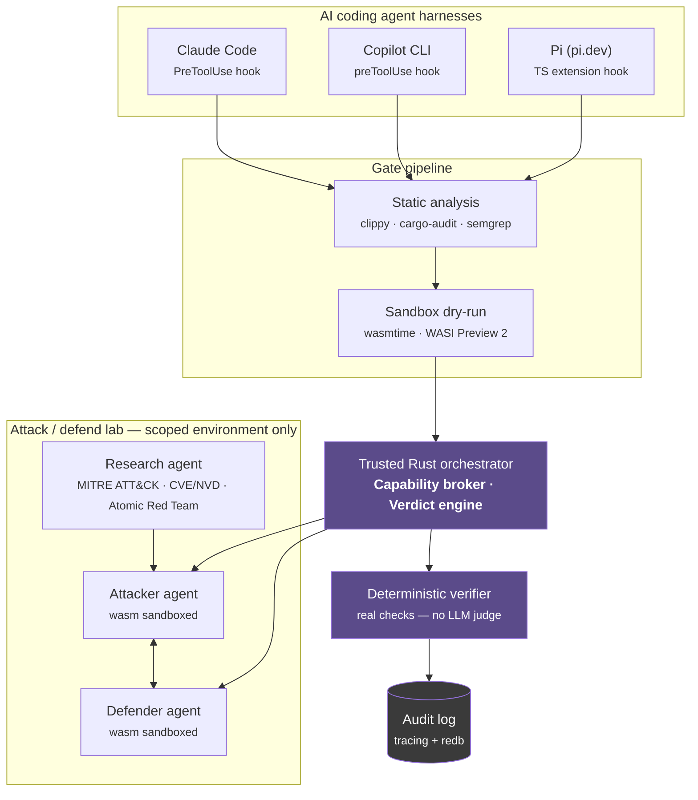

# rust-agentic-sandbox

A trusted Rust orchestrator that puts AI coding agents and AI security agents behind the same deterministic gate. It intercepts every file write, edit, and shell command an agent proposes, runs it through a capability-scoped WebAssembly sandbox, and lets a non-LLM verdict engine — never the model itself — decide what actually happens.

> **Status**: early scaffold. Workspace, crate stubs, and policy docs exist. Capability broker, sandbox execution, and agent logic are not implemented yet — see [CHANGELOG.md](./CHANGELOG.md).

## Why

AI coding agents (Claude Code, GitHub Copilot CLI, Pi) and AI security agents increasingly propose real actions — file writes, shell commands, attack techniques — with minimal review between proposal and execution. This project puts a structural boundary between "agent proposes" and "action happens," enforced by capability-scoped sandboxing and deterministic Rust logic, not by prompting the model to behave.

## Architecture

Two entry points, one shared core.



**Harness gate** — intercepts file writes, edits, and shell commands proposed by AI coding agents, before they touch disk or execute, using each harness's native hook system.

**Attack/defend lab** — a research agent feeds structured, vetted technique data (never novel exploit generation) to an attacker/defender pair, both capability-scoped to a declared, owned lab environment only ([lab/scope.toml](./lab/scope.toml)).

**Shared core** — both paths converge on the same capability broker, the same deterministic verdict engine, and the same append-only audit log. LLMs may summarize a verdict; they never author or override one. See [CONTEXT.md](./CONTEXT.md) for the full policy set.

## Stack

| Layer | Crates | Technology |
|---|---|---|
| Sandbox runtime | `gate-pipeline`, `lab-agents` | `wasmtime`, `wasmtime-wasi` (WASI Preview 2, Component Model) |
| Orchestration | `host`, `research-agent` | `tokio`, `petgraph` |
| Harness adapters | `adapter-claude-code`, `adapter-copilot-cli`, `adapter-pi` | native hook APIs per harness |
| Gate pipeline | `gate-pipeline` | `clippy`, `cargo-audit`, `semgrep` (shelled out) |
| Agent reasoning | `research-agent`, `lab-agents` | `aws-sdk-bedrockruntime` (host-side only, never in-sandbox) |
| Verification | `verifier` | pure Rust, deterministic |
| Audit trail | `audit` | `tracing`, `tracing-subscriber`, `redb` |
| Serialization | workspace-wide | `serde`, `serde_json` |

## Layout

```
rust-agentic-sandbox/
├── crates/
│   ├── host/               # orchestrator, capability broker, verdict engine
│   ├── adapters/
│   │   ├── claude-code/
│   │   ├── copilot-cli/
│   │   └── pi/
│   ├── gate-pipeline/       # static analysis + sandbox dry-run
│   ├── research-agent/      # threat-intel ingestion, technique queue
│   ├── lab-agents/          # attacker + defender agent stubs
│   ├── verifier/            # deterministic outcome verification
│   └── audit/               # tracing + redb-backed logging
├── lab/
│   └── scope.toml           # structural boundary for lab-agent capability grants
└── .github/workflows/
    └── ci.yml
```

## Quickstart

```bash
git clone https://github.com/arifbazli/rust-agentic-sandbox.git
cd rust-agentic-sandbox
cargo check --workspace
```

No runnable binary yet — this validates the workspace compiles. Crate logic lands incrementally; see [CHANGELOG.md](./CHANGELOG.md) for progress.

## Policies

Every non-negotiable design decision (verdict authority, capability-default-deny, lab scope lock, research-agent source allowlist, and more) is documented in [CONTEXT.md](./CONTEXT.md). Read it before contributing — it's the source of truth for how this project reasons about safety, not this README.

## Contributing

All changes land via feature branch + PR against `main`. Branch protection requires a passing CI run (`cargo check`, `cargo test`, `cargo clippy`) and at least one approving review — no direct pushes, including for admins.

## License

TBD.
