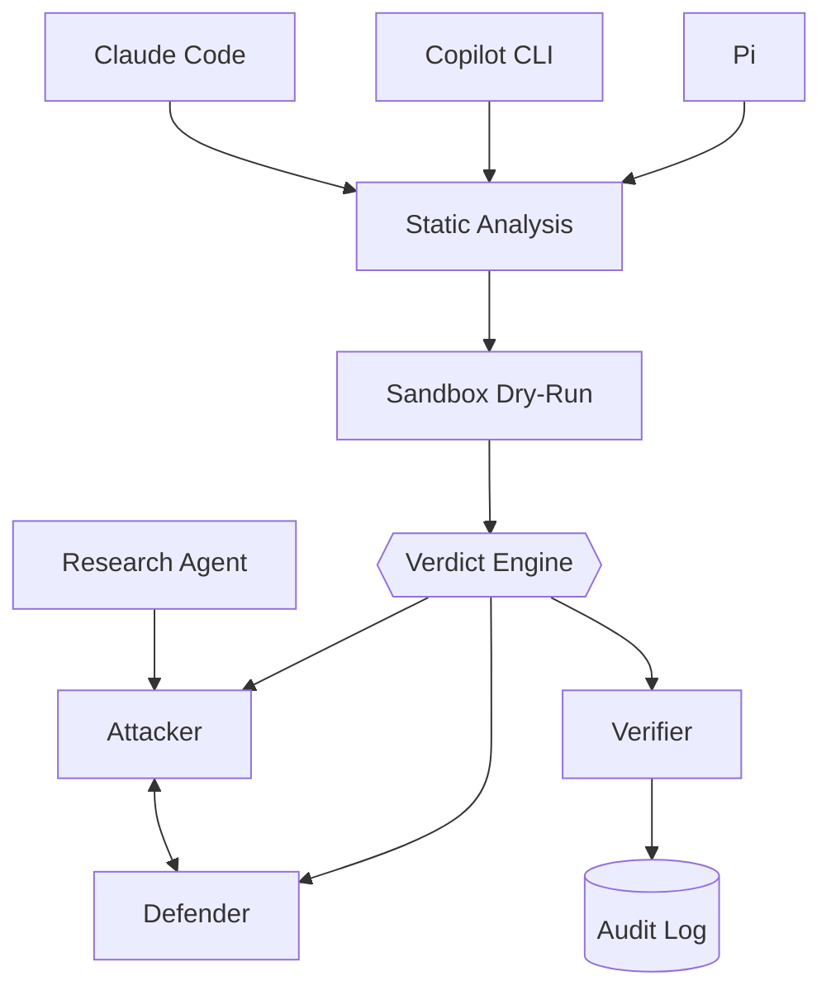

# rust-agentic-sandbox

A trusted Rust orchestrator that puts AI coding agents and AI security agents behind the same deterministic gate: it intercepts every file write, edit, and shell command an agent proposes, runs it through a capability-scoped WebAssembly sandbox, and lets a non-LLM verdict engine — never the model itself — decide what happens.

> **Status**: scaffold only. 9 crate stubs exist, each with an empty `[dependencies]` — no `wasmtime`, `tokio`, or any other crate is wired in yet, and no broker/sandbox/agent logic exists. See [CHANGELOG.md](./CHANGELOG.md).

## Architecture



- **Harness gate** — catches proposed writes/edits/commands via each tool's native hook, before they touch disk or execute.
- **Attack/defend lab** — a research agent feeds vetted techniques to a scoped attacker/defender pair ([lab/scope.toml](./lab/scope.toml)).
- **Shared core** — both paths converge on one capability broker, one verdict engine, one audit log. LLMs summarize verdicts; they never author or override them. Full policy: [CONTEXT.md](./CONTEXT.md).

Planned stack (not yet a dependency of any crate): `wasmtime`/WASI P2, `tokio`, `petgraph`, `aws-sdk-bedrockruntime`, `serde`, `tracing`, `redb`.

## Layout

```
crates/
├── host/            # broker + verdict engine
├── adapters/         # claude-code, copilot-cli, pi
├── gate-pipeline/     # static analysis + sandbox dry-run
├── research-agent/    # threat-intel ingestion
├── lab-agents/         # attacker + defender stubs
├── verifier/            # deterministic outcome checks
└── audit/                # tracing + redb log
lab/scope.toml               # lab capability boundary
```

## Quickstart

```bash
git clone https://github.com/arifbazli/rust-agentic-sandbox.git
cd rust-agentic-sandbox
cargo check --workspace
```

No runnable binary yet — see [CHANGELOG.md](./CHANGELOG.md) for progress.

## Contributing

Feature branch + PR against `main`. Required: passing CI (`cargo check`, `cargo test`, `cargo clippy`); 0 approving reviews currently required (solo maintainer), enforced for admins too — see actual settings via `gh api repos/arifbazli/rust-agentic-sandbox/branches/main/protection`. Policy lives in [CONTEXT.md](./CONTEXT.md).

## License

TBD.
