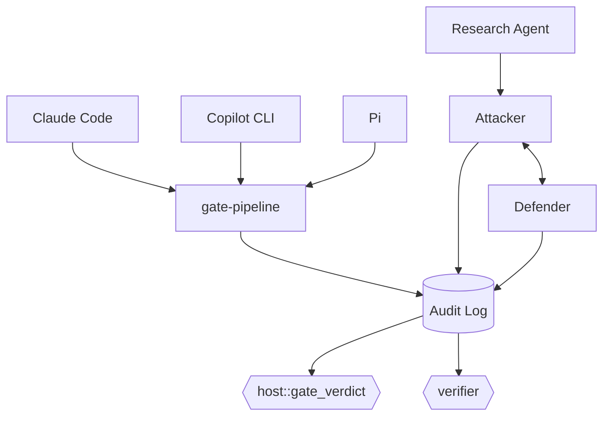

# rust-agentic-sandbox

A trusted Rust orchestrator that puts AI coding agents and AI security agents behind the same deterministic gate: it intercepts every file write, edit, and shell command an agent proposes, runs it through a capability-scoped sandbox, and lets a non-LLM verdict engine — never the model itself — decide what happens.

## Architecture



## Status — 46/46 tests passing

**Real:** `host` (capability broker + gate verdict), `audit` (redb log), `research-agent` (live Atomic Red Team ingestion), `lab-agents` (attacker + defender), `verifier` (lab-loop verdicts), `gate-pipeline` (deny-pattern static analysis + a real WASI sandbox dry-run) — all wired end-to-end via the shared audit log.

**Stub only:** `adapter-claude-code`, `adapter-copilot-cli`, `adapter-pi` — no coding-agent hook calls `gate-pipeline` yet.

`lab/scope.toml` is still the unpopulated placeholder template (expired validity window) — every lab technique attempt is correctly denied by design. Full policy: [CONTEXT.md](./CONTEXT.md).

## Quickstart

Development happens in **GitHub Codespaces** — Code button → Codespaces → Create codespace on `main`. `sshd` and the cargo-cache permission fix are preconfigured; the `wasm32-wasip1` target `gate-pipeline`'s sandbox guest needs is **not** yet (`rustup target add wasm32-wasip1` once, until `.devcontainer/` is updated).

Local also needs a C/C++ linker — a real gap this project hit on Windows — plus that same `wasm32-wasip1` target.

```bash
cargo check --workspace
cargo test --workspace
```

## Contributing

Feature branch + PR against `main`. Required: passing CI (`cargo check`, `cargo test`, `cargo clippy`); 0 approving reviews currently required (solo maintainer), enforced for admins too; no force-push or deletion on `main`. History: [CHANGELOG.md](./CHANGELOG.md).

## License

TBD.
