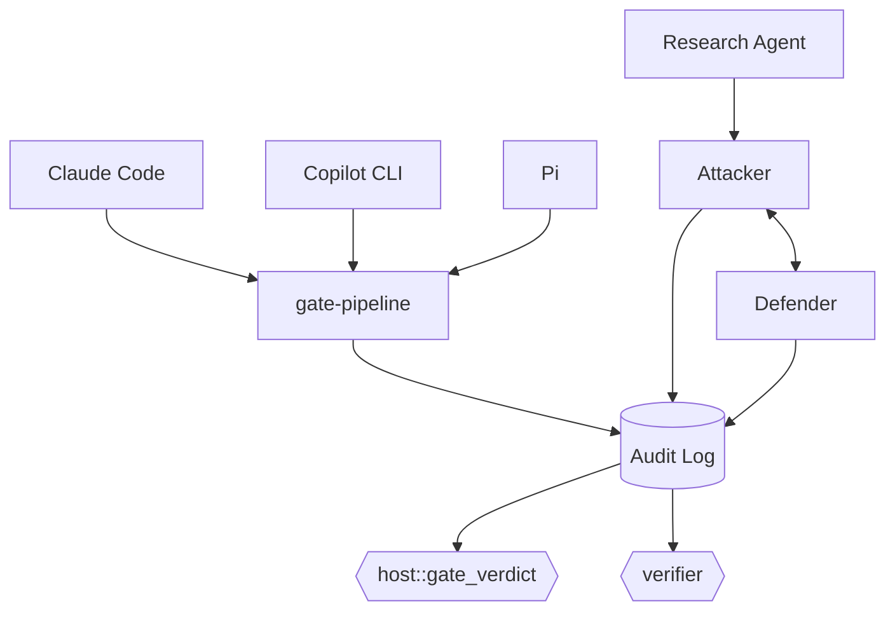

# rust-agentic-sandbox

A trusted Rust orchestrator that puts AI coding agents and AI security agents behind the same deterministic gate: it intercepts every file write, edit, and shell command an agent proposes, runs it through a capability-scoped sandbox, and lets a non-LLM verdict engine — never the model itself — decide what happens.

## Architecture



## Status — 88/88 tests passing

Both halves (harness gate, attack/defend lab) are wired end-to-end; no stub crates remain. `edit` is now gated for `adapter-claude-code` and `adapter-pi`, each reconstructing full file content from its harness's real (and genuinely different) diff schema.

**Known gaps:** Copilot CLI gates neither `edit` nor `create` — no documented schema exists for either, and unlike Pi there's no source repo to check instead; and no command-execution sandbox exists for `lab-agents::attacker` — `lab/scope.toml` grants T1059 for real, but nothing executes yet, so `verifier` only ever produces `Blocked`, never `Detected`/`Missed`.

Full policy: [CONTEXT.md](./CONTEXT.md). Full history: [CHANGELOG.md](./CHANGELOG.md).

## Quickstart

Development happens in **GitHub Codespaces** — Code button → Codespaces → Create codespace on `main`. `sshd` and the cargo-cache permission fix are preconfigured; the `wasm32-wasip1` target `gate-pipeline`'s sandbox guest needs is **not** yet (`rustup target add wasm32-wasip1` once, until `.devcontainer/` is updated).

Local also needs a C/C++ linker — a real gap this project hit on Windows — plus that same `wasm32-wasip1` target.

```bash
cargo check --workspace
cargo test --workspace
```

## Contributing

Feature branch + PR against `main`. Required: passing CI (`cargo check`, `cargo test`, `cargo clippy`); 0 approving reviews currently required (solo maintainer), enforced for admins too; no force-push or deletion on `main`. History: [CHANGELOG.md](./CHANGELOG.md).

## License

TBD.
