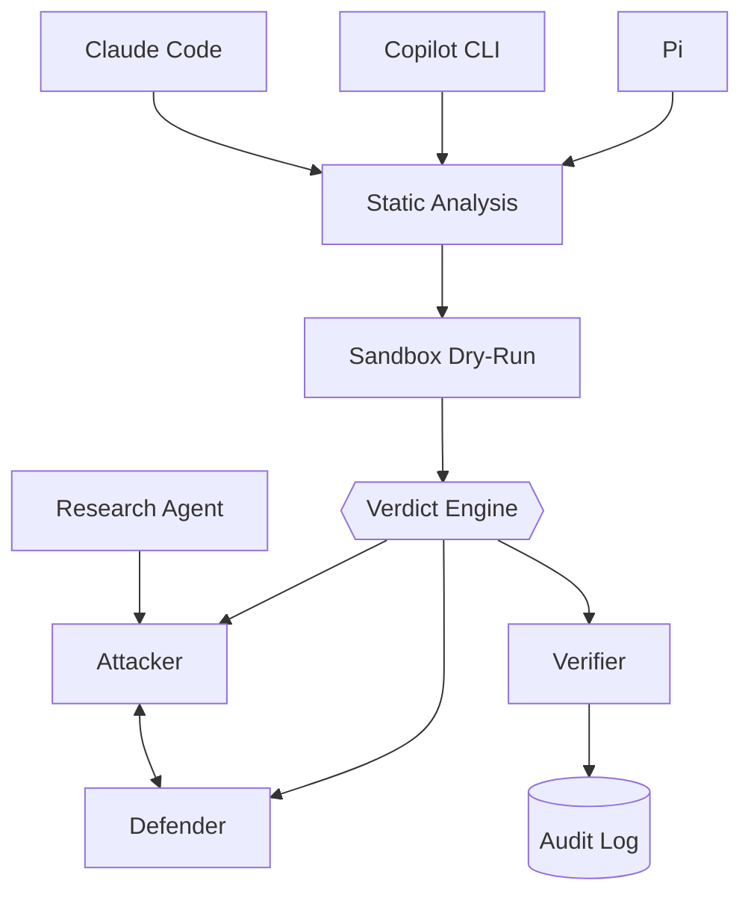

# rust-agentic-sandbox

A trusted Rust orchestrator that puts AI coding agents and AI security agents behind the same deterministic gate: it intercepts every file write, edit, and shell command an agent proposes, runs it through a capability-scoped sandbox, and lets a non-LLM verdict engine — never the model itself — decide what happens.

## Architecture



## Status

**Real and tested:** `host` (capability broker, scope parser), `audit` (redb-backed log), `research-agent` (live Atomic Red Team ingestion), `lab-agents` (attacker + defender), `verifier` (deterministic verdicts) — the full attack/defend loop runs end-to-end. **13/13 tests passing.**

**Stub only, no logic yet:** `gate-pipeline`, `adapter-claude-code`, `adapter-copilot-cli`, `adapter-pi` — empty dependencies, doc comments only. The harness-gate half of this project isn't built.

`lab/scope.toml` is still the unpopulated placeholder template (expired validity window) — every lab technique attempt is correctly denied by design. See [CONTEXT.md](./CONTEXT.md).

## Layout

```
crates/
├── host/            # real — capability broker, scope parser
├── audit/            # real — redb-backed event/verdict log
├── research-agent/    # real — Atomic Red Team ingestion
├── lab-agents/         # real — attacker + defender
├── verifier/            # real — deterministic verdicts
├── gate-pipeline/        # stub — no logic yet
└── adapters/              # stub — claude-code, copilot-cli, pi
lab/scope.toml                # placeholder template, expired
```

## Quickstart

**Codespaces (supported path)** — Code button → Codespaces → Create codespace on `main`. Toolchain, `sshd`, and the cargo-cache permission fix are all preconfigured.

**Local** needs a working C/C++ linker (for build scripts and proc-macros) in addition to `cargo`/`rustc` — this project's own history hit that exact gap on a fresh Windows machine. Codespaces avoids it entirely.

```bash
cargo check --workspace
cargo test --workspace
```

## Policy & history

Non-negotiable design policy: [CONTEXT.md](./CONTEXT.md). What's shipped, in order: [CHANGELOG.md](./CHANGELOG.md).

## Contributing

Feature branch + PR against `main`. Required: passing CI (`cargo check`, `cargo test`, `cargo clippy`); 0 approving reviews currently required (solo maintainer), enforced for admins too; no force-push or deletion on `main`.

## License

TBD.
