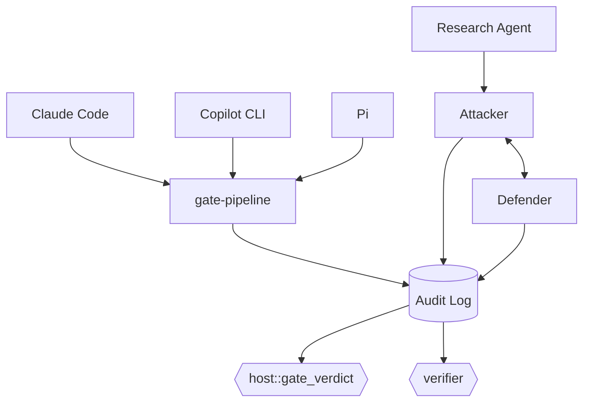

# rust-agentic-sandbox

A trusted Rust orchestrator that puts AI coding agents and AI security agents behind the same deterministic gate: it intercepts every file write, edit, and shell command an agent proposes, runs it through a capability-scoped sandbox, and lets a non-LLM verdict engine — never the model itself — decide what happens.

## Architecture



## Status — 98/98 tests passing

Both halves (harness gate, attack/defend lab) are wired end-to-end; no stub crates remain. `edit` is gated for `adapter-claude-code` and `adapter-pi`, each reconstructing full file content from its harness's real (and genuinely different) diff schema. A real `wasmtime`/WASI-Preview-1 execution engine now exists for `lab-agents::attacker` — `verifier` can genuinely produce `Detected`/`Missed`, not just `Blocked`, for the first time — but only for a synthetic, self-authored proving technique built to prove the mechanism works end to end, not for real Atomic Red Team execution.

**Known gaps:** Copilot CLI gates neither `edit` nor `create` — re-investigated 2026-08-26: GitHub's own hooks reference types `toolArgs` as `unknown`, and [copilot-cli#3349](https://github.com/github/copilot-cli/issues/3349) confirms the ambiguity is an acknowledged upstream gap, not just unfound; still no source repo to check instead, unlike Pi. And no execution path exists for real techniques — T1059 still produces `Blocked`, unchanged; closing that is an open policy question (an OS-level sandboxed subprocess vs. staying wasmtime/WASI-only), not yet decided — see [DESIGN-execution-engine.md](./DESIGN-execution-engine.md).

Full policy: [CONTEXT.md](./CONTEXT.md). Full history: [CHANGELOG.md](./CHANGELOG.md).

## Quickstart

Development happens in **GitHub Codespaces** — Code button → Codespaces → Create codespace on `main`. `sshd` and the cargo-cache permission fix are preconfigured; the `wasm32-wasip1` target `gate-pipeline`'s sandbox guest needs is **not** yet (`rustup target add wasm32-wasip1` once, until `.devcontainer/` is updated).

Local also needs a C/C++ linker — a real gap this project hit on Windows — plus that same `wasm32-wasip1` target.

```bash
cargo check --workspace
cargo test --workspace
```

## Contributing

Feature branch + PR against `main`. Required: passing CI (`cargo check`, `cargo test`, `cargo clippy`); 0 approving reviews currently required (solo maintainer), enforced for admins too; no force-push or deletion on `main`. History: [CHANGELOG.md](./CHANGELOG.md).

## License

TBD.
