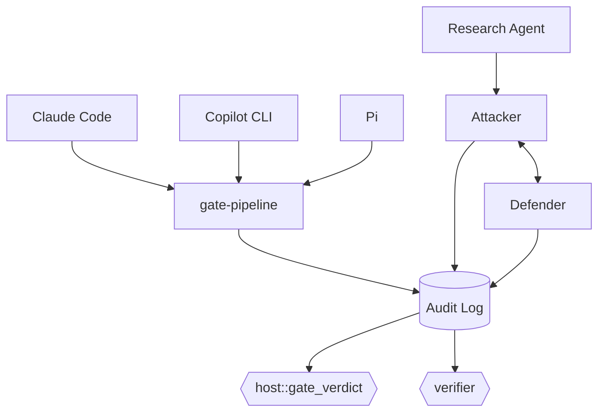

# rust-agentic-sandbox

A trusted Rust orchestrator that puts AI coding agents and AI security agents behind the same deterministic gate: it intercepts every file write, edit, and shell command an agent proposes, runs it through a capability-scoped sandbox, and lets a non-LLM verdict engine — never the model itself — decide what happens.

## Architecture



## Status — 78/78 tests passing

**Real, end-to-end, both halves for the first time:** `host`, `audit`, `research-agent`, `lab-agents`, `verifier`, `gate-pipeline` (deny-pattern static analysis + a real WASI sandbox dry-run), and all three harness adapters — no stub crates remain. The adapters differ in mechanism: `adapter-claude-code`/`adapter-copilot-cli` are one-shot stdin/stdout JSON hooks; `adapter-pi` is a persistent local HTTP bridge (`tiny_http`) paired with a reference-only TS extension, since Pi's extensions run in-process. `lab/scope.toml` is now real too, not a placeholder: a Codespace-contained scope with no cloud account, and `host::evaluate` genuinely returns `Granted` for T1059 via real, enforced path-containment.

**Known gaps:** no adapter gates `edit` yet (no harness documents a full-content schema for it); Copilot CLI's `create` tool has no documented schema at all, so that adapter never reaches the sandbox dry-run stage. The lab loop still only ever produces `Blocked` verdicts — no command-execution sandbox exists yet for `lab-agents::attacker`, so a granted, path-clean technique still doesn't actually run; `Detected`/`Missed` remain unreachable until that's built. Full policy: [CONTEXT.md](./CONTEXT.md).

## Quickstart

Development happens in **GitHub Codespaces** — Code button → Codespaces → Create codespace on `main`. `sshd` and the cargo-cache permission fix are preconfigured; the `wasm32-wasip1` target `gate-pipeline`'s sandbox guest needs is **not** yet (`rustup target add wasm32-wasip1` once, until `.devcontainer/` is updated).

Local also needs a C/C++ linker — a real gap this project hit on Windows — plus that same `wasm32-wasip1` target.

```bash
cargo check --workspace
cargo test --workspace
```

## Contributing

Feature branch + PR against `main`. Required: passing CI (`cargo check`, `cargo test`, `cargo clippy`); 0 approving reviews currently required (solo maintainer), enforced for admins too; no force-push or deletion on `main`. History: [CHANGELOG.md](./CHANGELOG.md).

## License

TBD.
