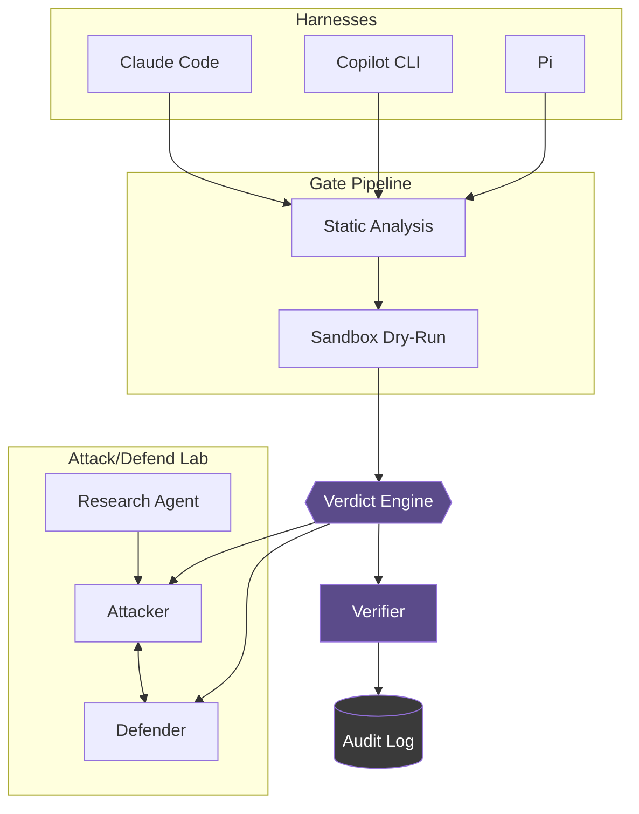

# rust-agentic-sandbox

A trusted Rust orchestrator that puts AI coding agents and AI security agents behind the same deterministic gate: it intercepts every file write, edit, and shell command an agent proposes, runs it through a capability-scoped WebAssembly sandbox, and lets a non-LLM verdict engine — never the model itself — decide what happens.

> **Status**: early scaffold — workspace, crate stubs, and policy docs only. No broker/sandbox/agent logic yet. See [CHANGELOG.md](./CHANGELOG.md).

## Architecture



- **Harness gate** — catches proposed writes/edits/commands via each tool's native hook, before they touch disk or execute.
- **Attack/defend lab** — a research agent feeds vetted techniques to a scoped attacker/defender pair ([lab/scope.toml](./lab/scope.toml)).
- **Shared core** — both paths converge on one capability broker, one verdict engine, one audit log. LLMs summarize verdicts; they never author or override them. Full policy: [CONTEXT.md](./CONTEXT.md).

## Stack

| Layer | Crates | Tech |
|---|---|---|
| Sandbox | `gate-pipeline`, `lab-agents` | `wasmtime` (WASI P2) |
| Orchestration | `host`, `research-agent` | `tokio`, `petgraph` |
| Adapters | `adapter-claude-code`, `adapter-copilot-cli`, `adapter-pi` | native hook APIs |
| Reasoning | `research-agent`, `lab-agents` | `aws-sdk-bedrockruntime` (host-side only) |
| Audit | `audit` | `tracing`, `redb` |
| Serde | workspace-wide | `serde`, `serde_json` |

## Layout

```
crates/
├── host/            # broker + verdict engine
├── adapters/         # claude-code, copilot-cli, pi
├── gate-pipeline/     # static analysis + sandbox dry-run
├── research-agent/    # threat-intel ingestion
├── lab-agents/         # attacker + defender stubs
├── verifier/            # deterministic outcome checks
└── audit/                # tracing + redb log
lab/scope.toml               # lab capability boundary
```

## Quickstart

```bash
git clone https://github.com/arifbazli/rust-agentic-sandbox.git
cd rust-agentic-sandbox
cargo check --workspace
```

No runnable binary yet — see [CHANGELOG.md](./CHANGELOG.md) for progress.

## Contributing

Feature branch + PR against `main`. CI (`check`/`test`/`clippy`) must pass. Policy lives in [CONTEXT.md](./CONTEXT.md) — read it first.

## License

TBD.
